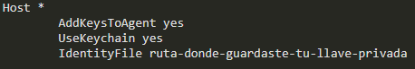

# Comandos básicos de git

Para abrir el editor de codigo VS Code.

> `$ code`

Para abrir el archivo en VS Code.

> `$ code archivo.txt`

Para visualizar la versión de git

> `$ git --version`

Para visualizar toda la configuración actual de git.

> `$ git config`

Para ver la configuración por defecto de git.

> `$ git config --list`

Para ver donde esta la configuración guardada (Solo para casos avanzados).

> `$ git config --list --show-origin`

Para cambiar la configuración del usuario de git.

> `$ git config --global user.name "Guadalupe Caraveo"`

Para cambiar la configuración del correo de git.

> `$ git config --global user.email "correo@gmail.com"`

---

Para inicializar el repositorio de git en la carpeta del proyecto.

> `$ git init`

Muestra el estado del proyecto (Para ver si hay cambio o no).

> `$ git status`

Para agrega un archivo editado a Staging donde se guarda temporalmente antes de ser enviado al repositorio.

> `$ git add archivo.txt`

Para agregar todos los archivos editados a staging donde se guarda temporalmente antes de ser enviado al repositorio.

> `$ git add .`

Sirve para eliminar archivos que ya no necesitemos mantener en nuestro repositorio.

> `git rm`

Para borrar el archivo del staging cuando se haya agregado con el comando `$ git add`.

> `git rm --cached archivo.txt`

Para enviar los cambios al repositorio, esto se realiza despues de haber agregado los cambios con `$ git add`.

> `$ git commit -m "Mensaje del commit"`

Para visualizar el historial de un archivo en especifico (commits).

> `$ git log archivo.txt`

Para mostrar el historial de los registros (commits) del proyecto.

> `$ git log`

para visualizar los cambios especificos en los archivos a partir del commit.

> `git log --stat`

Muestra los cambios que han existido sobre un archivo.

> `$ git show`

Para ver la diferencia entre una versión y otra.

> `git diff commitA commitB.`

---

Para volver a cualquier versión anterior de un archivo en específico o incluso del proyecto entero (ejemplo `git checkout + master + nombre archivo`).

> `git checkout + ID del commit`

Esta también es la forma de crear ramas y movernos entre ellas.

> `git checkout + Nombre_branch`

Permite regresar a una versión anterior y sobreescribir toda la historia. Se borraran los cambios que se hicieron despues de este commit (Ejemplo `git reset <ID commit>`).

> `$ git reset`

Borra toda la información que tengamos en el área de staging (Se borra todo definitivamente).

> `--hard`

Mantiene los archivos en el área de staging para poder aplicar los últimos cambios pero desde un commit anterior.

> `--soft`

Sirve para mover los archivos que no quisieramos incluir en el commit que realizaremos. De esta manera mantenemos los cambios, pero no lo registramos en el commit. Hasta que estemos seguros de incluirlo.

> `git reset HEAD`

Para borrar commits.

> `git branch -d`

---

Nos permite descargar los archivos de la última versión de la rama principal y todo el historial de cambios en la carpeta .git.

> ` git clone url_del_servidor_remoto`

Luego de hacer git add y git commit debemos ejecutar este comando para enviar los cambios al servidor remoto.

> `$ git push`

> `$ git push origin master`

Se usa para traer actualizaciones del servidor remoto y guardarlas en nuestro repositorio local. También usamos el comando `git fetch` con servidores remotos.

> `$ git fetch`

Se utiliza para combinar los últimos cambios del servidor remoto y nuestro directorio de trabajo (ejemplo `git merge "nombre de la rama"`).

> `git merge`

Básicamente, git fetch y git merge al mismo tiempo.

> `$ git pull`

Para actualizar la información del repositorio master al local.

> `$ git pull origin master`

Para agregar un origin remoto de los archivos.

> `$ git remote add origin "link del repositorio en git"`

Para mostrar el repositorio remoto.

> `$ git remote`

Comando para verificar que la URL se haya guardado corretamente, nos deberia traer la url donde hariamos el fecht y el push.

> `$ git remote -v`

Para forzar los cambios cuando existen historias o commit diferentes.

> `$ git pull origin master --allow-unrelated-histories`

---

Generar llaves SSH (windows, Linux, Mac).

> `$ ssh-keygen -t rsa -b 4096 -C "tu@email.com"`

Para encender el servidor de llaves SSH de la computadora (windows, Linux).

> `$ eval $(ssh-agent -s)`

Para añadir la llave SSH a este servidor (windows, Linux).

> `$ ssh-add ruta-gurdate-tu-llave-privada`

Encender el servidor de llaves SSH de la computadora (Mac).

> `$ eval "$(ssh-agent -s)"`

Si usas una versión de OSX superior a Mac Sierra (v10.12) debes crear o modificar un archivo "config" en la carpeta de tu usuario con el siguiente contenido (ten cuidado con las mayúsculas):

Añadir tu llave SSH al "servidor" de llaves SSH de tu computadora (en caso de error puedes ejecutar este mismo comando pero sin el argumento -K):

> `$ ssh-add -K ruta-donde-guardaste-tu-llave-privada`

Ahora podemos actualizar la URL que guardamos en nuestro repositorio remoto, solo que, en vez de guardar la URL con HTTPS, vamos a usar la URL con SSH:

> `$ git remote set-url origin url-ssh-del-repositorio-en-github`

---

Para crear un nuevo tag y asignarlo a un commit.

> `$ git tag -a nombre-del-tag id-del-commit`.

Para agregar un tag y agregarlo a un commit con su hash.

> `$ git tag + -a + version (v0.1) + -m + "Mensaje del commit" + hash (id commit)`

Borrar un tag en el repositorio local.

> `$ git tag -d nombre-del-tag`.

Listar los tags de nuestro repositorio local.

> `$ git tag o git show-ref --tags`.

Publicar un tag en el repositorio remoto.

> `$ git push origin --tags`.

Borrar un tag del repositorio remoto.

> `$ git tag -d nombre-del-tag y git push origin :refs/tags/nombre-del-tag`.

Para mostrar todo lo que se ha hechos historicamnete en el proyecto,.

> `$ git log --all`

Muestra las lineas de color de como se han fusionado las ramas en el proyecto.

> `$ git log --all --graph`

Para mostrar todo la historia del proyecto de manera más comprimida.

> `$ git log --all --graph --decorate --oneline`

Para agregar un alias al comando con un nombre más corto (temporal, mientras la terminal este activa).

> `$ alias arbolito="git log --all --graph --decorate --oneline"`

Para crear un alias de manera global.

> `$ git config --global alias.arbolito “git log --all --graph --decorate --oneline”`

---

Para saber la diferencia entre los cambios que hay en local y los cambios remoto (Ejemplo `git fetch` `git diff master origin/master`)

> `$ git fetch`

> `$ git diff <local_branch> <remote_branch>`

Para cambiar el nombre a una rama

> `$ git branch -m rama_vieja rama_nueva`

Para verificar que se han aplicado los cambios.

> `$ git branch -a`

En caso de que la rama_vieja este en un repositorio de github, basta con ejecutar el comando push de la siguiente forma.

> `$ git push origin --delete rama_vieja`

> `$ git push origin :rama_vieja rama_nueva`

---

Muestra todas las ramas que existen.

> `$ git branch`

Muestra las ramas que existen y sus historias.

> `$ git show-branch`

Muestra algo similar que el comando anterior pero con más datos.

> `$ git show-branch --all`

Crear una rama en el repositorio local.

> `$ git branch nombre-de-la-rama`

> `$ git checkout -b nombre-de-la-rama`.

Publicar una rama local al repositorio remoto.

> `$ git push origin nombre-de-la-rama`.

Para ver gráficamente nuestro entorno y flujo de trabajo local con Git.

> `$ gitk`

---

Para trabajar con más de un repositorio remoto y poder trabajar con ambos es necesario crear un repositorio remoto adicional.

> `git remote add <nombre_del_remoto> <url_del_remoto> `

> `git remote upstream https://github.com/freddier/hyperblog`

Al crear un remoto adicional podremos, hacer pull desde el nuevo origen (en caso de tener permisos podremos hacer fetch y push).

> `git pull <remoto> <rama>`

> `git pull upstream master`

Éste pull traerá los cambios del remoto, por lo que estará al día en el proyecto, el flujo de trabajo cambia, en adelante se estará trabajando haciendo pull desde el upstream y push al origin para pasar a hacer pull request.

> `git pull upstream master`

> `git push origin master`

Para borrar una rama.

> `$ git branch -D <nombre_rama>`

Recopila uno a uno los cambios confirmados en una rama y los reaplica sobre otra.

> `$ git rebase master`

Para guardar los cambios en memoria de manera temporal

> `git stash `

Para traer los cambios que se encuentran en memoria.
Muestra los cambios guardados en stash, también podemos mostrar los cambios de un stash determinado usando su índice que nos muestra el git stash list "git stash pop stash@{1} " siendo el índice {0} el último stash guardado.

> `git stash pop`

Muestra la lista de todos los stash que tengamos guardados.

> `git stash list`

Para borrar los cambios guardados en stash.

> `git stash drop`

Para crear una nueva rama y enviar todos los cambios.

> `git stash branch nombre_rama`

> **Nota:** recuerda regresar a la rama original antes de quitar el stash.
