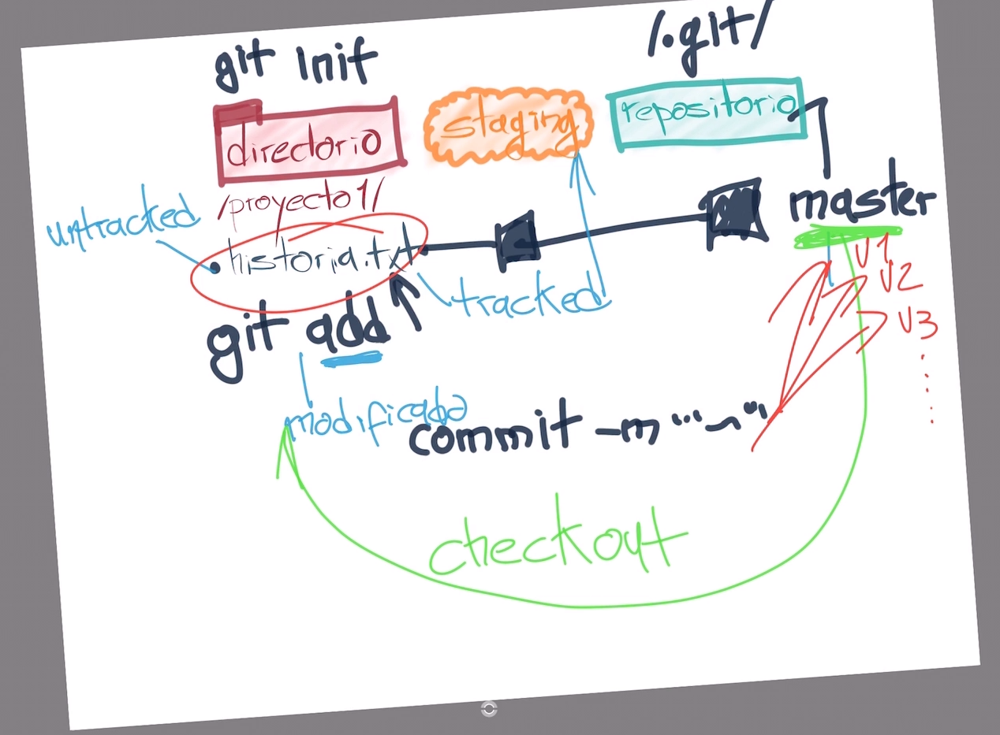
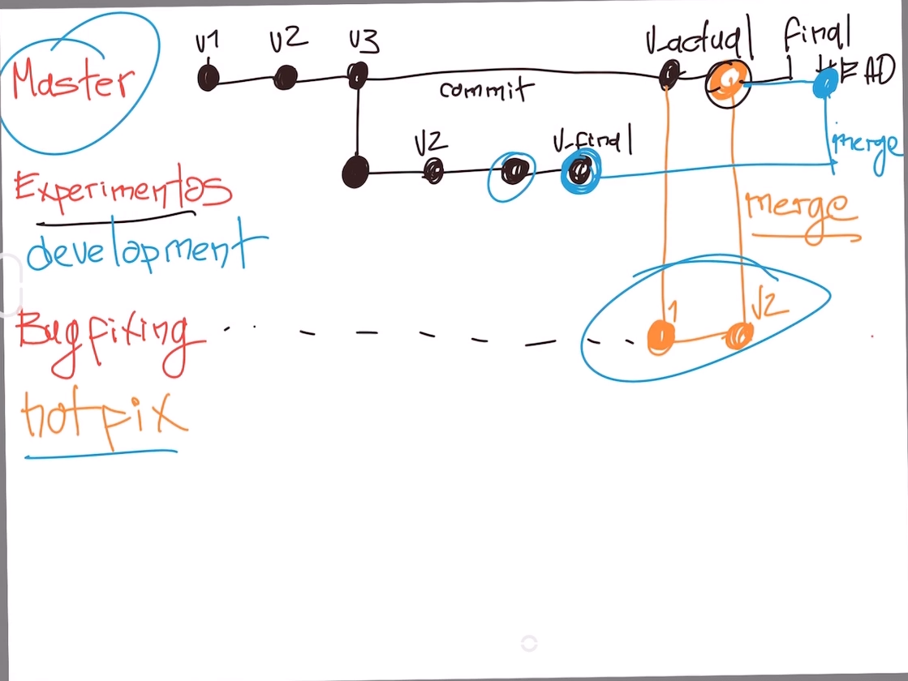

# Instalación de Git en Linux

### Cada distribución de Linux tiene un comando especial para instalar herramientas y actualizar el sistema. En las distribuciones derivadas de **Debian (como Ubuntu)** el comando especial es `apt-get`, en **Red Hat** es `yum` y en **ArchLinux** es `pacman`.

### Antes de hacer la instalación, es necesario realizar una actualización del sistema. En este caso, los comandos para hacerlo son `sudo apt-get update` y `sudo apt-get upgrade`.

### Con el sistema actualizado, se procede a instalar **Git**, el comando para hacerlo es `sudo apt-get install git`. Puedes verificar que Git fue instalado correctamente con el comando git --version.s

### Analiza todo lo que esta instalado y actualiza la lista de paquetes.

- > `sudo apt-get update`
- > `sudo apt-get upgrade`

### Para instalar git

- > `sudo apt-get install git`

# Comandos básicos en la terminal:

### Para mostrar la lista de archivos y carpetas en la ruta ubicada.

- > `$ ls`

### Muestra la ruta de carpetas en la que nos encontramos.

- > `$ pwd `

### Permite crear carpetas (por ejemplo, `mkdir Carpeta-Importante`).

- > `$ mkdir`

### Permite crear archivos (por ejemplo, `touch archivo.txt`).

- > `$ touch`

### Permite borrar un archivo o carpeta (por ejemplo, `rm archivo.txt`). Mucho cuidado con este comando, puedes borrar todo tu disco duro.

- > `$ rm`

### Permite visualizar el contenido de un archivo (por ejemplo, `cat nombre-archivo.txt`).

- > `$ cat`

### Permite visualizar los archivos de la carpeta donde estamos ahora mismo. Podemos usar uno o más argumentos para ver más información sobre estos archivos (los argumentos pueden ser -- + el nombre del argumento o - + una sola letra o shortcut por cada argumento).

- > `$ ls`

### Muestra todos los archivos que contiene una carpeta, incluso los ocultos pero no en una lista.

- > `$ ls -a`

### Para visualizar todos los archivos e incluso los archivos ocultos y los coloque en una lista.

- > `$ ls -al`

### Podrá visualizar todos los archivos en una lista.

- > `$ ls -l`

### Nos permite navegar entre carpetas.

- > `cd`

### Para ir a la ruta principal.

- > `cd /`

### Para ir a la ruta de tu usuario.

- > `cd o cd ~`

### Para navegar a una ruta dentro de la carpeta donde nos encontramos.

- > `cd carpeta/subcarpeta`

### Regresar una carpeta hacia atrás.

- > `cd ..`

### Si quieres referirte al directorio en el que te encuentras ahora mismo puedes usar:

- > `cd .`

### Para ver los últimos comandos que ejecutamos y un número especial con el que podemos repetir su ejecución.

- > `history`

### Ejecutar algún comando con el número que nos muestra el comando history (por ejemplo, !72).

- > `! + número`

### Para limpiar la terminal. También podemos usar los atajos de teclado `Ctrl + L` o `Command + L`.

- > `clear`

### Podrá descubrir todos los argumentos de un comando (por ejemplo, cat --help).

- > `--help`

### Para salir de la interfaz de mensajes.

- > `Esc + shif + zz`

### Para insertar texto en la interfaz.

- > `Esc + i`

# ¿Qué es Git?

### Git es un software de control de versiones diseñado por Linus Torvalds, pensando en la eficiencia y la confiabilidad del mantenimiento de versiones de aplicaciones cuando estas tienen un gran número de archivos de código fuente. Git funciona como una línea de tiempo que nos permite regresar a momentos específicos del código.

### En su lugar GitHub es una forja para alojar proyectos utilizando el sistema de control de versiones Git.

# ¿Por qué usar un sistema de control de versiones como Git?

### Un sistema de control de versiones como Git nos ayuda a guardar el historial de cambios y crecimiento de los archivos de nuestro proyecto.

### En realidad, los cambios y diferencias entre las versiones de nuestros proyectos pueden tener similitudes, algunas veces los cambios pueden ser solo una palabra o una parte específica de un archivo específico. Git está optimizado para guardar todos estos cambios de forma atómica e incremental, o sea, aplicando cambios sobre los últimos cambios, estos sobre los cambios anteriores y así hasta el inicio de nuestro proyecto.

### El comando para iniciar nuestro repositorio, es decir, indicarle a Git que queremos usar su sistema de control de versiones en nuestro proyecto, es `git init`.

### El comando para que nuestro repositorio sepa de la existencia de un archivo o sus últimos cambios es git add. Este comando no almacena las actualizaciones de forma definitiva, solo las guarda en algo que conocemos como **“Staging Area”**.

### El comando para almacenar definitivamente todos los cambios que por ahora viven en el staging area es `git commit`. También podemos guardar un mensaje para recordar muy bien qué cambios hicimos en este commit con el argumento `-m "Mensaje del commit"`.

### Por último, si queremos mandar nuestros commits a un servidor remoto, un lugar donde todos podamos conectar nuestros proyectos, usamos el comando `git push`.

# Ciclo básico de trabajo en Git

### Para iniciar un repositorio, solo hay que ejecutar el comando `git init`.

### Este comando se encargará de dos cosas:

> ### **1.** Creará una carpeta **.git**, donde se guardará toda la base de datos con cambios atómicos del proyecto.
>
> ### **2.** Creará un área que conocemos como Staging, que guardará temporalmente los archivos y permitirá más adelante guardar estos cambios en el repositorio.

## Ciclo de vida o estados de los archivos en Git

### Cuando trabajamos con Git nuestros archivos pueden vivir y moverse entre 4 diferentes estados:

- ### **Archivos Tracked:** son los archivos que viven dentro de Git, no tienen cambios pendientes y sus últimas actualizaciones han sido guardadas en el repositorio gracias a los comandos git add y git commit.
- ### **Archivos Staged:** son archivos en Staging. Viven dentro de Git y hay registro de ellos porque han sido afectados por el comando git add, aunque no sus últimos cambios. Git ya sabe de la existencia de estos últimos cambios, pero todavía no han sido guardados definitivamente en el repositorio porque falta ejecutar el comando git commit.
- ### **Archivos Unstaged:** entiéndelos como archivos “Tracked pero Unstaged”. Son archivos que viven dentro de Git pero no han sido afectados por el comando git add ni mucho menos por git commit. Git tiene un registro de estos archivos, pero está desactualizado, sus últimas versiones solo están guardadas en el disco duro.
- ### **Archivos Untracked:** son archivos que NO viven dentro de Git, solo en el disco duro. Nunca han sido afectados por git add, así que Git no tiene registros de su existencia.

  

## Comandos para mover archivos entre los estados de Git:

- ### **git status:** nos permite ver el estado de todos nuestros archivos y carpetas.
- ### **git add:** nos ayuda a mover archivos del Untracked o Unstaged al estado Staged. Podemos usar git nombre-del-archivo-o-carpeta para añadir archivos y carpetas individuales o git add -A para mover todos los archivos de nuestro proyecto (tanto Untrackeds como unstageds).
- ### **git reset HEAD:** nos ayuda a sacar archivos del estado Staged para devolverlos a su estado anterior. Si los archivos venían de Unstaged, vuelven allí. Y lo mismo se venían de Untracked.
- ### **git commit:** nos ayuda a mover archivos de Unstaged a Tracked. Esta es una ocasión especial, los archivos han sido guardado o actualizados en el repositorio. Git nos pedirá que dejemos un mensaje para recordar los cambios que hicimos y podemos usar el argumento -m para escribirlo (git commit -m "mensaje").
- ### **git rm:** este comando necesita alguno de los siguientes argumentos para poder ejecutarse correctamente:
- ### **git rm --cached:** Mueve los archivos que le indiquemos al estado Untracked.
- ### **git rm --force:** Elimina los archivos de Git y del disco duro. Git guarda el registro de la existencia de los archivos, por lo que podremos recuperarlos si es necesario (pero debemos usar comandos más avanzados).

# ¿Qué es un Branch y cómo funciona un Merge en Git?

### Git es una base de datos muy precisa con todos los cambios y crecimiento que ha tenido nuestro proyecto. Los commits son la única forma de tener un registro de los cambios. Pero las ramas amplifican mucho más el potencial de Git.

### Todos los commits se aplican sobre una rama. Por defecto, siempre empezamos en la rama master y creamos nuevas ramas, a partir de esta, para crear flujos de trabajo independientes.

### Crear una nueva rama se trata de copiar un commit (de cualquier rama), pasarlo a otro lado (a otra rama) y continuar el trabajo de una parte específica de nuestro proyecto sin afectar el flujo de trabajo principal (que continúa en la rama master o la rama principal).

### Los equipos de desarrollo tienen un estándar: Todo lo que esté en la rama master va a producción, las nuevas features, características y experimentos van en una rama “development” (para unirse a master cuando estén definitivamente listas) y los issues o errores se solucionan en una rama “hotfix” para unirse a master tan pronto como sea posible.

### Crear una nueva rama lo conocemos como Checkout. Unir dos ramas lo conocemos como Merge.

### Podemos crear todas las ramas y commits que queramos. Podemos aprovechar el registro de cambios de Git para crear ramas, traer versiones viejas del código, arreglarlas y combinarlas de nuevo para mejorar el proyecto.

### Solo ten en cuenta que combinar estas ramas (sí, hacer “merge”) puede generar conflictos. Algunos archivos pueden ser diferentes en ambas ramas. Git es muy inteligente y puede intentar unir estos cambios automáticamente, pero no siempre funciona. En algunos casos, somos nosotros los que debemos resolver estos conflictos “a mano”.

# Volver en el tiempo en nuestro repositorio utilizando reset y checkout

### El comando git checkout + ID del commit nos permite viajar en el tiempo. Podemos volver a cualquier versión anterior de un archivo específico o incluso del proyecto entero. Esta también es la forma de crear ramas y movernos entre ellas.

### También hay una forma de hacerlo un poco más “ruda”: usando el comando `git reset`. En este caso, no solo “volvemos en el tiempo”, sino que borramos los cambios que hicimos después de este commit.

### Hay dos formas de usar git reset: con el argumento --hard, borrando toda la información que tengamos en el área de staging (y perdiendo todo para siempre) O un poco más seguro, con el argumento --soft, que mantiene allí los archivos del área de staging para que podamos aplicar nuestros últimos cambios pero desde un commit anterior.

# Comandos básicos de git

### Para abrir el editor de codigo VS Code.

- > `$ code`

### Para abrir el archivo en VS Code.

- > `$ code archivo.txt`

### Para visualizar la versión de git

- > `$ git --version`

### Para visualizar toda la configuración actual de git.

- > `$ git config`

### Para ver la configuración por defecto de git.

- > `$ git config --list`

### Para ver donde esta la configuración guardada (Solo para casos avanzados).

- > `$ git config --list --show-origin`

### Para cambiar la configuración del usuario de git.

- > `$ git config --global user.name "Guadalupe Caraveo"`

### Para cambiar la configuración del correo de git.

- > `$ git config --global user.email "correo@gmail.com"`

### Para inicializar el repositorio de git en la carpeta del proyecto.

- > `$ git init`

### Muestra el estado del proyecto (Para ver si hay cambio o no).

- > `$ git status`

### Para agrega un archivo editado a Staging donde se guarda temporalmente antes de ser enviado al repositorio.

- > `$ git add archivo.txt`

### Para agregar todos los archivos editados a staging donde se guarda temporalmente antes de ser enviado al repositorio.

- > `$ git add .`

### Para borrar el archivo del staging cuando se haya agregado con el comando `$ git add`.

- > `git rm --cached archivo.txt`

### Para enviar los cambios al repositorio, esto se realiza despues de haber agregado los cambios con `$ git add`.

- > `$ git commit -m "Mensaje del commit"`

### Para visualizar el historial de un archivo en especifico (commits).

- > `$ git log archivo.txt`

### Para mostrar el historial de los registros (commits) del proyecto.

- > `$ git log`

### para visualizar los cambios especificos en los archivos a partir del commit.

- > `git log --stat`

### Muestra los cambios que han existido sobre un archivo.

- > `$ git show`

### Para ver la diferencia entre una versión y otra.

- > `git diff commitA commitB.`

### Para volver a cualquier versión anterior de un archivo en específico o incluso del proyecto entero.

- > `git checkout + ID del commit`

### Esta también es la forma de crear ramas y movernos entre ellas.

- > `git checkout + Nombre_branch`

### Permite regresar a una versión anterior, pero tambien se borraran los cambios que se hicieron despues de este commit (Ejemplo `git reset <ID commit>`).

- > `$ git reset`

### Borra toda la información que tengamos en el área de staging (Se borra todo definitivamente).

- > `--hard`

### Mantiene los archivos en el área de staging para poder aplicar los últimos cambios pero desde un commit anterior.

- > `--soft`

###

- > `$ git push`

###

- > `$ git pull`
