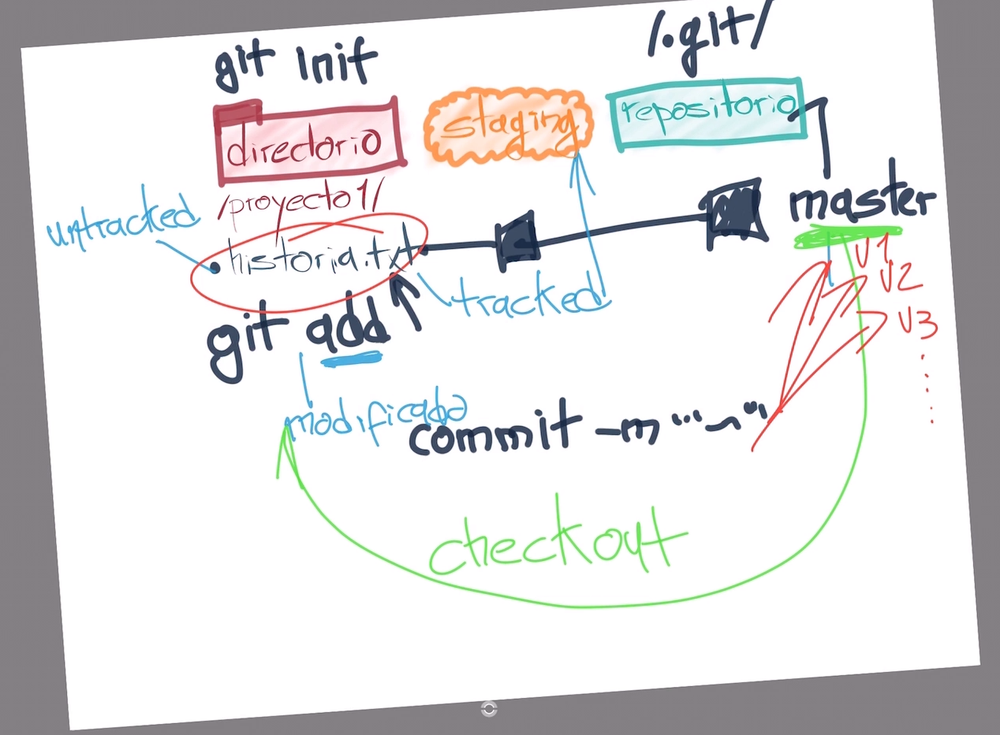
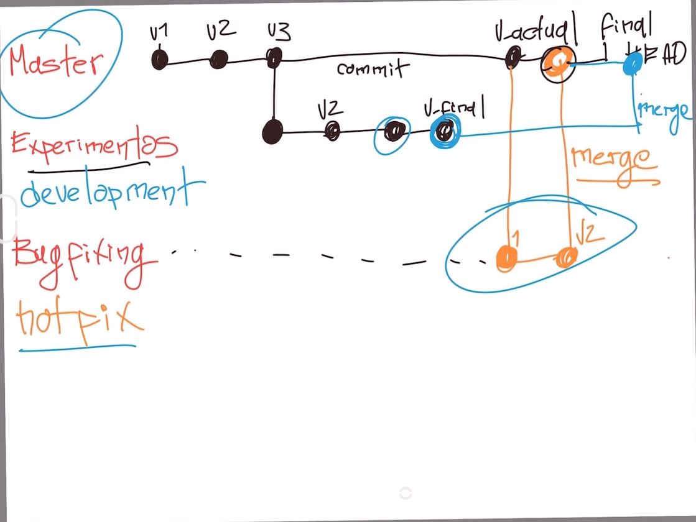
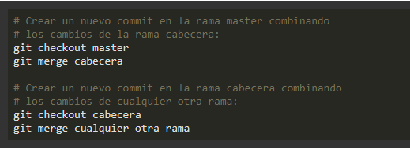
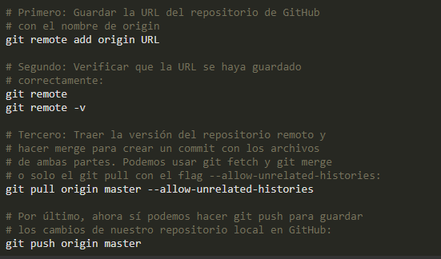
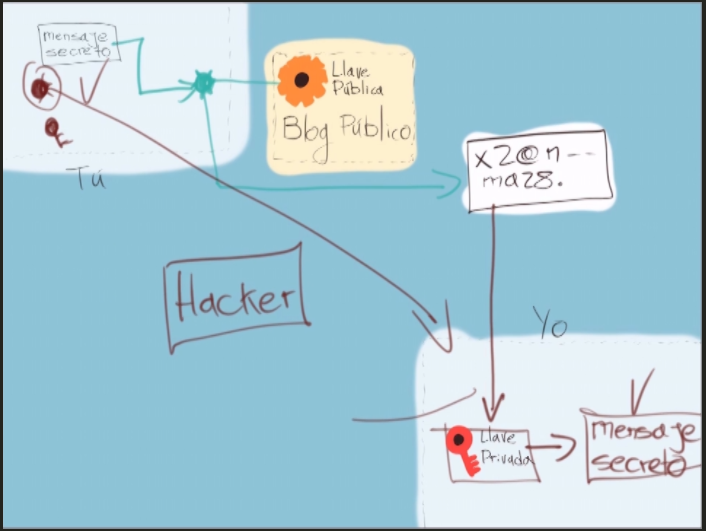
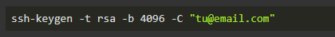
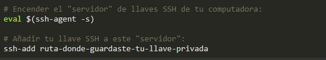
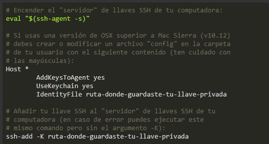
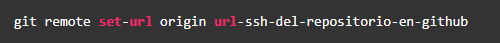

# Curso profesional de Git y GitHub

# ¿Qué es Git?

### Git es un software de control de versiones diseñado por Linus Torvalds, pensando en la eficiencia y la confiabilidad del mantenimiento de versiones de aplicaciones cuando estas tienen un gran número de archivos de código fuente. Git funciona como una línea de tiempo que nos permite regresar a momentos específicos del código.

### En su lugar GitHub es una forja para alojar proyectos utilizando el sistema de control de versiones Git.

# ¿Por qué usar un sistema de control de versiones como Git?

### Un sistema de control de versiones como Git nos ayuda a guardar el historial de cambios y crecimiento de los archivos de nuestro proyecto.

### En realidad, los cambios y diferencias entre las versiones de nuestros proyectos pueden tener similitudes, algunas veces los cambios pueden ser solo una palabra o una parte específica de un archivo específico. Git está optimizado para guardar todos estos cambios de forma atómica e incremental, o sea, aplicando cambios sobre los últimos cambios, estos sobre los cambios anteriores y así hasta el inicio de nuestro proyecto.

### El comando para iniciar nuestro repositorio, es decir, indicarle a Git que queremos usar su sistema de control de versiones en nuestro proyecto, es `git init`.

### El comando para que nuestro repositorio sepa de la existencia de un archivo o sus últimos cambios es git add. Este comando no almacena las actualizaciones de forma definitiva, solo las guarda en algo que conocemos como **“Staging Area”**.

### El comando para almacenar definitivamente todos los cambios que por ahora viven en el staging area es `git commit`. También podemos guardar un mensaje para recordar muy bien qué cambios hicimos en este commit con el argumento `-m "Mensaje del commit"`.

### Por último, si queremos mandar nuestros commits a un servidor remoto, un lugar donde todos podamos conectar nuestros proyectos, usamos el comando `git push`.

# Ciclo básico de trabajo en Git

### Para iniciar un repositorio, solo hay que ejecutar el comando `git init`.

### Este comando se encargará de dos cosas:

> ### **1.** Creará una carpeta **.git**, donde se guardará toda la base de datos con cambios atómicos del proyecto.
>
> ### **2.** Creará un área que conocemos como Staging, que guardará temporalmente los archivos y permitirá más adelante guardar estos cambios en el repositorio.

## Ciclo de vida o estados de los archivos en Git

### Cuando trabajamos con Git nuestros archivos pueden vivir y moverse entre 4 diferentes estados:

- ### **Archivos Tracked:** son los archivos que viven dentro de Git, no tienen cambios pendientes y sus últimas actualizaciones han sido guardadas en el repositorio gracias a los comandos git add y git commit.
- ### **Archivos Staged:** son archivos en Staging. Viven dentro de Git y hay registro de ellos porque han sido afectados por el comando git add, aunque no sus últimos cambios. Git ya sabe de la existencia de estos últimos cambios, pero todavía no han sido guardados definitivamente en el repositorio porque falta ejecutar el comando git commit.
- ### **Archivos Unstaged:** entiéndelos como archivos “Tracked pero Unstaged”. Son archivos que viven dentro de Git pero no han sido afectados por el comando git add ni mucho menos por git commit. Git tiene un registro de estos archivos, pero está desactualizado, sus últimas versiones solo están guardadas en el disco duro.
- ### **Archivos Untracked:** son archivos que NO viven dentro de Git, solo en el disco duro. Nunca han sido afectados por git add, así que Git no tiene registros de su existencia.

  

## Comandos para mover archivos entre los estados de Git:

- ### **git status:** nos permite ver el estado de todos nuestros archivos y carpetas.
- ### **git add:** nos ayuda a mover archivos del Untracked o Unstaged al estado Staged. Podemos usar git nombre-del-archivo-o-carpeta para añadir archivos y carpetas individuales o git add -A para mover todos los archivos de nuestro proyecto (tanto Untrackeds como unstageds).
- ### **git reset HEAD:** nos ayuda a sacar archivos del estado Staged para devolverlos a su estado anterior. Si los archivos venían de Unstaged, vuelven allí. Y lo mismo se venían de Untracked.
- ### **git commit:** nos ayuda a mover archivos de Unstaged a Tracked. Esta es una ocasión especial, los archivos han sido guardado o actualizados en el repositorio. Git nos pedirá que dejemos un mensaje para recordar los cambios que hicimos y podemos usar el argumento -m para escribirlo (git commit -m "mensaje").
- ### **git rm:** este comando necesita alguno de los siguientes argumentos para poder ejecutarse correctamente:
- ### **git rm --cached:** Mueve los archivos que le indiquemos al estado Untracked.
- ### **git rm --force:** Elimina los archivos de Git y del disco duro. Git guarda el registro de la existencia de los archivos, por lo que podremos recuperarlos si es necesario (pero debemos usar comandos más avanzados).

# ¿Qué es un Branch y cómo funciona un Merge en Git?

### Git es una base de datos muy precisa con todos los cambios y crecimiento que ha tenido nuestro proyecto. Los commits son la única forma de tener un registro de los cambios. Pero las ramas amplifican mucho más el potencial de Git.

### Todos los commits se aplican sobre una rama. Por defecto, siempre empezamos en la rama master y creamos nuevas ramas, a partir de esta, para crear flujos de trabajo independientes.

### Crear una nueva rama se trata de copiar un commit (de cualquier rama), pasarlo a otro lado (a otra rama) y continuar el trabajo de una parte específica de nuestro proyecto sin afectar el flujo de trabajo principal (que continúa en la rama master o la rama principal).

### Los equipos de desarrollo tienen un estándar: Todo lo que esté en la rama master va a producción, las nuevas features, características y experimentos van en una rama “development” (para unirse a master cuando estén definitivamente listas) y los issues o errores se solucionan en una rama “hotfix” para unirse a master tan pronto como sea posible.

### Crear una nueva rama lo conocemos como Checkout. Unir dos ramas lo conocemos como Merge.

### Podemos crear todas las ramas y commits que queramos. Podemos aprovechar el registro de cambios de Git para crear ramas, traer versiones viejas del código, arreglarlas y combinarlas de nuevo para mejorar el proyecto.

### Solo ten en cuenta que combinar estas ramas (sí, hacer “merge”) puede generar conflictos. Algunos archivos pueden ser diferentes en ambas ramas. Git es muy inteligente y puede intentar unir estos cambios automáticamente, pero no siempre funciona. En algunos casos, somos nosotros los que debemos resolver estos conflictos “a mano”.

# Volver en el tiempo en nuestro repositorio utilizando reset y checkout

### El comando git checkout + ID del commit nos permite viajar en el tiempo. Podemos volver a cualquier versión anterior de un archivo específico o incluso del proyecto entero. Esta también es la forma de crear ramas y movernos entre ellas.

### También hay una forma de hacerlo un poco más “ruda”: usando el comando `git reset`. En este caso, no solo “volvemos en el tiempo”, sino que borramos los cambios que hicimos después de este commit.

### Hay dos formas de usar git reset: con el argumento --hard, borrando toda la información que tengamos en el área de staging (y perdiendo todo para siempre) O un poco más seguro, con el argumento --soft, que mantiene allí los archivos del área de staging para que podamos aplicar nuestros últimos cambios pero desde un commit anterior.

# Git reset vs. Git rm

## git rm

### Este comando nos ayuda a eliminar archivos de Git sin eliminar su historial del sistema de versiones. Esto quiere decir que si necesitamos recuperar el archivo solo debemos “viajar en el tiempo” y recuperar el último commit antes de borrar el archivo en cuestión.

### Recuerda que git rm no se puede usar así nada más, se debe utilizar uno de los flags para indicarle a Git cómo eliminar los archivos que ya no necesitamos en la última versión del proyecto:

- ### **git rm --cached:** Elimina los archivos del área de Staging y del próximo commit pero los mantiene en nuestro disco duro.
- ### **git rm --force:** Elimina los archivos de Git y del disco duro. Git siempre guarda todo, por lo que podemos acceder al registro de la existencia de los archivos, de modo que podremos recuperarlos si es necesario (pero debemos usar comandos más avanzados).

## git reset

### Este comando nos ayuda a volver en el tiempo. Pero no como `git checkout` que nos deja ir, mirar, pasear y volver. Con `git reset` volvemos al pasado sin la posibilidad de volver al futuro. Borramos la historia y la debemos sobreescribir. No hay vuelta atrás.

### Este comando es muy peligroso y debemos usarlo solo en caso de emergencia. Hay dos formas de usar git reset:

### Con el argumento `--hard`, borra toda la información que se tenga en el área de staging (y perdiendo todo para siempre) O un poco más seguro, con el argumento `--soft`, que mantiene allí los archivos del área de staging para que podamos aplicar nuestros últimos cambios pero desde un commit anterior.

- ### **`git reset --soft:`** Borra todo el historial y los registros de Git pero guardamos los cambios que tengamos en Staging, así podemos aplicar las últimas actualizaciones a un nuevo commit.
- ### **`git reset --hard:`** Toda la información de los commits y del área de staging se borra del historial.

- ### **`git reset HEAD:`** Este es el comando para sacar archivos del área de Staging. No para borrarlos ni nada de eso, solo para que los últimos cambios de estos archivos no se envíen al último commit, a menos que cambiemos de opinión y los incluyamos de nuevo en staging con `git add`.

### Si usamos `git reset HEAD`, lo único que haremos será mover estos cambios de Staging a Unstaged. Seguiremos teniendo los últimos cambios del archivo, el repositorio mantendrá el archivo (no con sus últimos cambios pero sí con los últimos en los que hicimos commit) y no habremos perdido nada.

# Introducción a las ramas o branches de Git

### Las ramas son la forma de hacer cambios en nuestro proyecto sin afectar el flujo de trabajo de la rama principal. Esto porque queremos trabajar una parte muy específica de la aplicación o simplemente experimentar.

### La cabecera o HEAD representan la rama y el commit de esa rama donde estamos trabajando. Por defecto, esta cabecera aparecerá en el último commit de nuestra rama principal. Pero podemos cambiarlo al crear una rama (git branch rama, git checkout -b rama) o movernos en el tiempo a cualquier otro commit de cualquier otra rama con los comandos (git reset id-commit, git checkout rama-o-id-commit).

# Fusión de ramas con Git merge

### El comando git merge nos permite crear un nuevo commit con la combinación de dos ramas (la rama donde nos encontramos cuando ejecutamos el comando y la rama que indiquemos después del comando).

# Uso de GitHub

### GitHub es una plataforma que nos permite guardar repositorios de Git que podemos usar como servidores remotos y ejecutar algunos comandos de forma visual e interactiva (sin necesidad de la consola de comandos).

### Luego de crear nuestra cuenta, podemos crear o importar repositorios, crear organizaciones y proyectos de trabajo, descubrir repositorios de otras personas, contribuir a esos proyectos, dar estrellas y muchas otras cosas.

### El README.md es el archivo que veremos por defecto al entrar a un repositorio. Es una muy buena práctica configurarlo para describir el proyecto, los requerimientos y las instrucciones que debemos seguir para contribuir correctamente.

### Para clonar un repositorio desde GitHub (o cualquier otro servidor remoto) debemos copiar la URL (por ahora, usando HTTPS) y ejecutar el comando git clone + la URL que acabamos de copiar. Esto descargara la versión de nuestro proyecto que se encuentra en GitHub.

### Sin embargo, esto solo funciona para las personas que quieren empezar a contribuir en el proyecto. Si queremos conectar el repositorio de GitHub con nuestro repositorio local, el que creamos con git init, debemos ejecutar las siguientes instrucciones:

# Cómo funcionan las llaves públicas y privadas

### Las llaves públicas y privadas nos ayudan a cifrar y descifrar nuestros archivos de forma que los podamos compartir sin correr el riesgo de que sean interceptados por personas con malas intenciones.

### La forma de hacerlo es la siguiente:

- ### Ambas personas deben crear su llave pública y privada.
- ### Ambas personas pueden compartir su llave pública a las otras partes (recuerda que esta llave es pública, no hay problema si la “interceptan”).
- ### La persona que quiere compartir un mensaje puede usar la llave pública de la otra persona para cifrar los archivos y asegurarse que solo puedan ser descifrados con la llave privada de la persona con la que queremos compartir el mensaje.
- ### El mensaje está cifrado y puede ser enviado a la otra persona sin problemas en caso de que los archivos sean interceptados.
- ### La persona a la que enviamos el mensaje cifrado puede usar su llave privada para descifrar el mensaje y ver los archivos.
- ### Puedes compartir tu llave pública pero nunca tu llave privada.

# Configura tus llaves SSH en local

### **Primer paso: Generar tus llaves SSH.** Recuerda que es muy buena idea proteger tu llave privada con una contraseña.

### **Segundo paso:** Terminar de configurar nuestro sistema.

### **En Windows y Linux:**

### Ejemplo: `$ ssh-add ~/.ssh/ide_rsa`

### **En Mac:**

# Conexión a GitHub con SSH

### Luego de crear nuestras llaves SSH podemos entregarle la llave pública a GitHub para comunicarnos de forma segura y sin necesidad de escribir nuestro usuario y contraseña todo el tiempo.

### Para esto debes entrar a la Configuración de Llaves SSH en GitHub, crear una nueva llave con el nombre que le quieras dar y el contenido de la llave pública de tu computadora.

### Ahora podemos actualizar la URL que guardamos en nuestro repositorio remoto, solo que, en vez de guardar la URL con HTTPS, vamos a usar la URL con SSH:

# Tags y versiones en Git y GitHub

### Los tags o etiquetas nos permiten asignar versiones a los commits con cambios más importantes o significativos de nuestro proyecto.

### Comandos para trabajar con etiquetas:

- ### Crear un nuevo tag y asignarlo a un commit: `git tag -a nombre-del-tag id-del-commit`.
- ### Borrar un tag en el repositorio local: `git tag -d nombre-del-tag`.
- ### Listar los tags de nuestro repositorio local: `git tag o git show-ref --tags`.
- ### Publicar un tag en el repositorio remoto: `git push origin --tags`.
- ### Borrar un tag del repositorio remoto: `git tag -d nombre-del-tag y git push origin :refs/tags/nombre-del-tag`.
